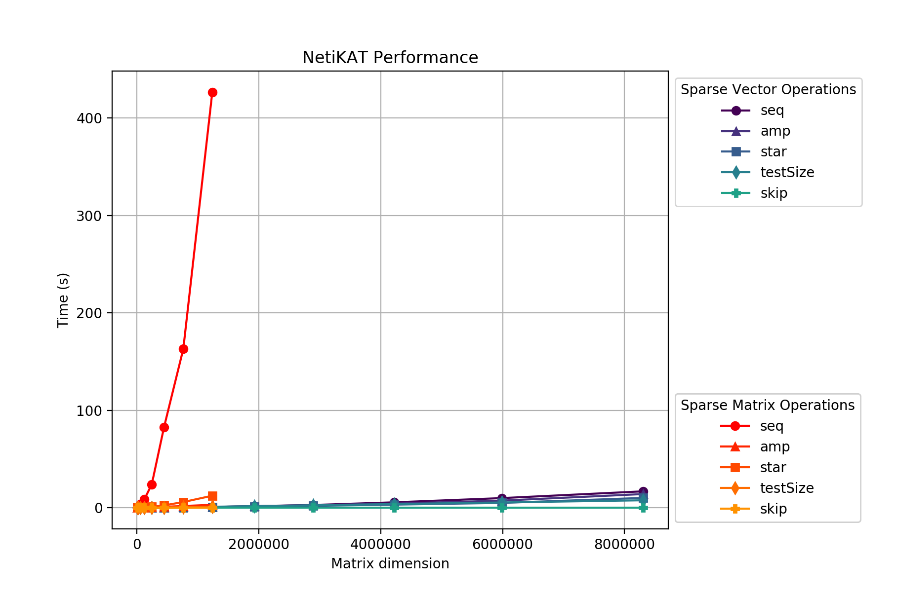
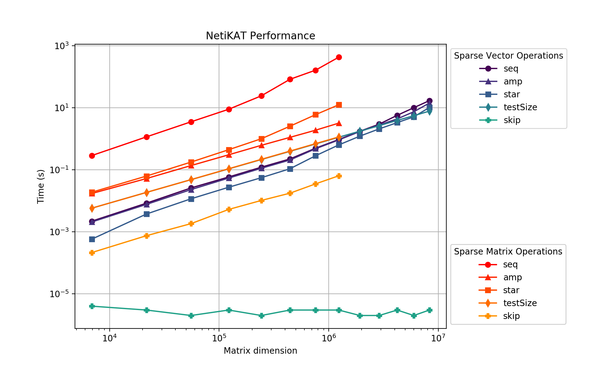
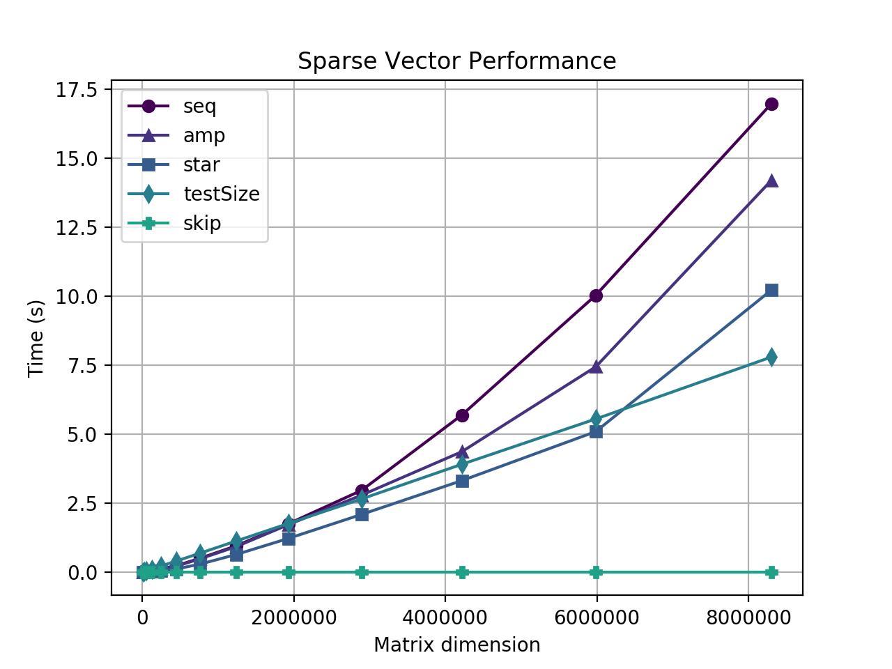

# NetiKat

## Performance Optimizations
The `SparseVector` branch of the code contains an experimental version that doesn't compute the program's entire stochastic matrix, and instead computes the result of running the program on a single input distribution. This yields less information, but is still useful for determining properties of the program. Importantly, it uses far less memory than computing the entire matrix.

|||
|:----:|:-----:|
|Performance Comparison|Performance Comparison (Log-Log Scale)|

Somewhat surprisingly, the most expensive part of the matrix-based computation is matrix-matrix products. Furthermore, the code is memory-limited - while running the benchmarks I had to stop half-way through because I ran out of memory. Switching to work with vectors solves both of these issues.

These benchmarks aren't necessarily indicative of how NetiKAT will perform on real code - the sparsity of the matrices/vectors involved is very important, and I have no idea what the real sparsity will look like. The benchmark generates random vectors with 24 nonzero entries. If the vectors become dense, then the performance of `SparseVector` degrades terribly. It should hopefully still be better in terms of memory.

Even though our matrices are really big, they still don't represent very large networks. The largest matrices I benchmarked were around 8 million x 8 million, and that only represents a network with 64 possible packets containing up to 5 packets at a time. We should be able to scale to slightly larger networks - the current bottleneck is actually generating random sparse matrices for the benchmark. But getting significantly bigger will be a challenge.



Interestingly, matrix multiplication is still the slowest operation in the `SparseVector` setting, but it's now more in line with the other operations.

## Building NetiKat

This repository uses git submodules. To clone, run `git clone [URL] --recursive`.

To build, run
```
mkdir build
cd build
cmake ..
make -j7
```

This creates a folder `bin` with the executables inside the build directory. There is `bin/run` to run the code and `bin/test` to run the tests.
